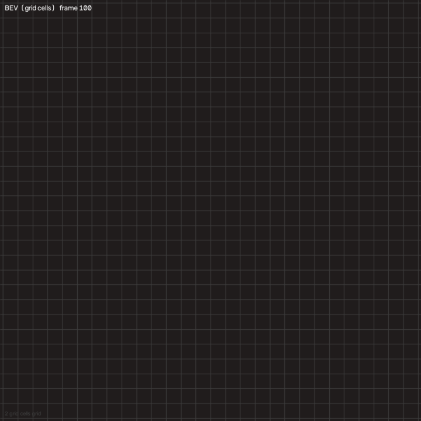
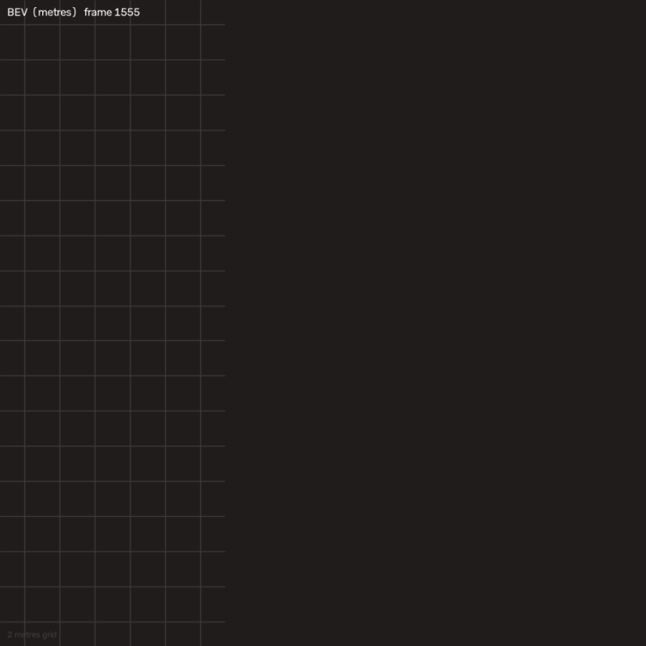
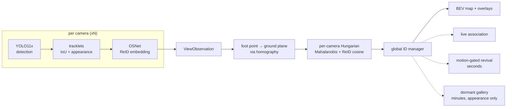

# mcreid — multi-camera persistent-ID tracking with a live BEV map

## vA Guard development continuation — 2026-10-08

The product scope is **vA Guard**. The existing face-recognition and floor-plan
tracking system is the starting point. This repository and EPFL support tracking
validation for Guard; the next product work is authorization, zone rules,
procedure assurance and evidence-backed events.
See the [vA Guard development plan](docs/va_guard_development_plan.md).
EPFL ground truth now uses **cell centres**, matching CVLab's `grid_to_tv`
reference, and its header exposes `step_size` (annotation interval in frames)
instead of mislabelling it as video FPS. The offline demo reads FPS from the videos.
New summaries carry `ground_truth_convention: cell_center_v1`.
`scripts/check_epfl_instrument.py --geometry-only` checks GT projection coverage
without videos, model weights or a GPU. Its separate report never claims that
the detector agreement check ran.
Two existing map rendering defects are also corrected: the live-view title
does not overlap the map, and camera footprints respect the room boundary
after OpenCV's float32 clipping.

The committed EPFL metrics below predate this correction and are historical:
rerun the instrument and offline benchmark before citing current EPFL accuracy.
No new accuracy or identity-continuity result is claimed by this correction.
EPFL Laboratory positions remain in **grid cells**, with no established metre scale.

```bash
uv sync --extra dev
uv run pytest tests/test_calib_epfl.py
```

A few overlapping cameras, one global ID per person. Someone entering any view
gets an identity and keeps it across camera handoffs, through occlusions — even
total occlusion from every camera at once — and across absences of minutes.

The target regime is **one to a handful of people in a room**, not crowds. That
is where a purely geometric, zero-training system does well, and the project is
scoped to it deliberately. Where it stops working is measured and written down
rather than left out: see [Stress test](#stress-test--where-this-breaks-and-why).

## Current state of this checkout

This tree is the upstream tracker plus the local work used to *show* it. The
detector, the OSNet embedder, the per-view tracker, and the fusion were not
replaced. What was added is a way to watch EPFL on consecutive frames, a
schematic map for that window, an Apple MPS device path, a two-camera office
replay, and a local fair-loop assembler. The published EPFL and WILDTRACK
numbers later in this file were not recomputed for those additions.

### Install

Python **3.11 only** (`requires-python >=3.11,<3.12`). Use
[uv](https://docs.astral.sh/uv/).

Core only — calibration, fusion, synthetic scenes, tests. No torch:

```bash
uv venv --python 3.11
uv pip install -e ".[dev]"
```

Real video needs the perception extra. On macOS, PyPI's wheel (Apple MPS). Do
not pass the CUDA index:

```bash
uv pip install -e ".[dev,perception]"
```

Linux or Windows, CUDA 12.6:

```bash
uv pip install -e ".[dev,perception]" --extra-index-url https://download.pytorch.org/whl/cu126
```

`auto` device order is CUDA, then Apple MPS, then CPU. MPS runs fp32
(`half=False`). The long EPFL and WILDTRACK jobs refuse CPU unless
`--allow-cpu`. On the machine that timed the live window below, CUDA was
absent and the probe resolved to MPS.

### Fresh clone — what a second machine has to download

Cloning does **not** bring EPFL, WILDTRACK, or model weights. `data/` and
`weights/` are gitignored. The clone does include the procedural GIFs, the
two office clips (`cam0.mp4`, `cam1.mp4`), and `outputs/demo/recorded.mp4`.

```bash
git clone https://github.com/beratbaspinar/birdeyetech.git
cd birdeyetech
uv venv --python 3.11
uv pip install -e ".[dev,perception]"
```

On Linux or Windows with CUDA 12.6, add
`--extra-index-url https://download.pytorch.org/whl/cu126` to that last
command. macOS must not.

**1. EPFL videos** (~310 MB, no registration). This is the only fetch for the
Laboratory sequence. It writes four files and two text files into
`data/epfl_lab/` and nothing else — no floor-plan image, no WILDTRACK:

```bash
uv run python scripts/fetch_epfl.py
```

You should then have `6p-c0.avi` … `6p-c3.avi`, `calibration-6p.txt`, and
`gt_lab_6p.txt`. Re-running the script skips files that are already there.

**2. Detector weights, by hand.** The live window and the benchmark both
refuse to start if the `.pt` file is missing. Ultralytics is not asked to
fetch it. Interactive demo (smaller, ~19 MB):

```bash
mkdir -p weights
curl -L --fail -o weights/yolo11s.pt \
  https://github.com/ultralytics/assets/releases/download/v8.3.0/yolo11s.pt
```

Published EPFL / WILDTRACK detector (~110 MB). Same release, different file.
Use this when you omit `--weights`, because that default is `yolo11x.pt`:

```bash
curl -L --fail -o weights/yolo11x.pt \
  https://github.com/ultralytics/assets/releases/download/v8.3.0/yolo11x.pt
```

**3. Appearance weights, automatic.** The first command that embeds a person
runs `curl` and checks the SHA-256 of `weights/osnet_x1_0_msmt17.pth` against
`OSNET_MSMT17` in `src/mcreid/track/reid_models.py`. `curl` has to be on
`PATH`. If the download fails, the error prints the URL and the path to fill
in by hand.

**4. Open the window.** People enter around frame 100, so start there:

```bash
uv run mcreid-public-demo epfl --live-view --live-start 100 --presentation-map --weights weights/yolo11s.pt
```

`q` or Esc closes it, space pauses, `r` restarts at frame 100. Drop
`--weights weights/yolo11s.pt` only after `yolo11x.pt` is in `weights/`. On
the Mac that timed this, 11s was about 7 FPS and 11x about 2 FPS. Keys and
the schematic plate are under
[Watch EPFL](#watch-epfl--consecutive-frames-one-window).

WILDTRACK is a separate download and a separate consent step. `fetch_epfl.py`
does not touch it. See [WILDTRACK](#wildtrack) below.

### What runs, and what each command is for

| you want | command | GPU / weights | writes |
|---|---|---|---|
| Watch EPFL while inference runs | `uv run mcreid-public-demo epfl --live-view --live-start 100` | perception; `yolo11x` by default | one OpenCV window. No benchmark files |
| Same window, faster, labelled as not the benchmark | add `--weights weights/yolo11s.pt` | `yolo11s` | same window |
| Schematic 56×56 plate instead of the working map | add `--presentation-map` | same | display only |
| Offline EPFL benchmark (the GIF on this page) | `uv run mcreid-public-demo epfl --stages all` | `yolo11x`, 60 frames 1 s apart | `docs/assets/epfl_demo_bev.gif` and gitignored `reports/epfl_demo/` |
| Prove the EPFL homography before believing a number | `uv run python scripts/check_epfl_instrument.py` | none for the geometry check | stdout |
| Two office cameras, no floor | `uv run mcreid-demo recorded --videos cam0.mp4,cam1.mp4` | `yolo11s` + OSNet | `outputs/demo/recorded.mp4` |
| Synthetic occlusion scene | `uv run mcreid-demo synthetic --scenario cardboard` | no weights | `outputs/demo/cardboard.mp4`. Exit code 1 is the current bar |
| Narrated synthetic walkthrough | `uv run mcreid-hpc-demo --out reports/hpc_demo.mp4` | no weights | gitignored mp4 |
| WILDTRACK crowd stress test | `uv run mcreid-public-demo wildtrack` | CUDA expected; `--allow-cpu` to override | procedural BEV only in `docs/assets/` |
| One webcam | `uv run mcreid-live --device 0` | perception | optional clip under `reports/` |
| Several webcams, no shared floor | `uv run mcreid-live-multi run --devices 0,1` | perception | raw recording + timestamp CSV |

Fetch EPFL once (~310 MB, no registration). The script downloads only
`6p-c0.avi` … `6p-c3.avi`, `calibration-6p.txt`, and `gt_lab_6p.txt` into
gitignored `data/epfl_lab/`:

```bash
uv run python scripts/fetch_epfl.py
```

There is **no floor-plan image** in that set or in this repo. The `358×360`
constant in `src/mcreid/calib/epfl.py` is the homography's pixel frame, not a
bitmap.

### Watch EPFL — consecutive frames, one window

The GIF at the top is a bird's-eye view of the *benchmark* path: 60 labelled
frames, one per second. `--live-view` does not play that file back. It opens
the four `6p-c*.avi` files together and, on every step, runs the existing
stack on the next real frame:

detection → OSNet embedding → per-view tracking → cross-camera fusion →
the dataset's own ground-plane homography.

```bash
uv run mcreid-public-demo epfl --live-view --live-start 100 --presentation-map
```

Faster on a laptop, and labelled on screen as a demo configuration:

```bash
uv run mcreid-public-demo epfl --live-view --live-start 100 --presentation-map --weights weights/yolo11s.pt
```

The window is 1920×1080. Left: four cameras, each box labelled `G` global id,
`L` local id, and confidence. Right: the map, with the global id, the current
grid-cell position, and a trail of the last 25 inferred frames. The banner
prints the measured inference rate, for example `Inference: 7.1 FPS`. If the
machine is slower than the file's 25 fps, frames are **not** dropped. You
watch the real rate.

People are not really in view until around video frame 100–120. `--live-start
100` skips the empty opening. `--live-frames N` stops after N inferred frames
(`0` runs until `q` or the end of the files). `--live-snapshot-dir DIR` saves
a few preview PNGs; omit it and nothing is written.

| key | what it does |
|---|---|
| `q` or Esc | quit |
| space | pause / resume |
| `r` | restart at `--live-start`. New trackers, same loaded weights |
| `a` or left | previous frame this process has already inferred |
| `d` or right | one frame forward. Infers it if you are at the frontier |
| `m` | schematic plate ↔ the working map |
| `f` | show or hide camera coverage polygons |

Ground-truth positions are parsed only to read the 56×56 grid header and to
log where the first annotated slot is. They are not passed to detection,
tracking, or fusion. The per-view tracker on this path uses the normal
`n_init=2`. The 1 Hz benchmark still uses `n_init=1`, because boxes a second
apart do not overlap; that workaround is not applied to the live window.

**One live-only fusion change, and it is a cap, not a new tracker.** The
published config rejects a foot whose positional sigma is above **4.5 cells**.
A person who fills the 288 px frame has a box on the image border; fusion then
multiplies that foot's variance by 9, the sigma climbs past 4.5, and the dot
freezes while all four cameras still see the person. `--live-view` copies the
config and widens only `max_position_sigma_m` to **8.5 cells**.
`epfl_fusion_config()` stays at 4.5, and the offline benchmark still calls
that function. A foot near the horizon, whose sigma is tens of cells, is still
rejected.

**Measured on this Mac (Apple MPS, imgsz 640, conf 0.25, consecutive frames,
warmup excluded):** YOLO11x about **2.1 FPS**, YOLO11s about **7.1 FPS**. The
four cameras reported the same frame index. The map point moved between
frames. The global id on the boxes matched the id on the map. These rates are
this machine, not a claimed product FPS.

### Presentation map

`--presentation-map` changes the drawing, not the coordinates. Dots still land
through the same `to_pixels` on the dataset's `0…56 × 0…56` grid. The plate is
a flat schematic of that extent: no walls, doors, or furniture, because none
could be read out of the files. The canvas says `SCHEMATIC (grid cells)` and
`SCHEMATIC 56x56 grid - no floor-plan image`. Coverage polygons start hidden;
`f` draws them, `m` returns to the working map (polygons on). Without the
flag, the live window is the previous working map.

Axes say **grid cells**. The metric scale is unidentifiable from this dataset
(no intrinsics; a vertical 1.75 m head plane on only 2 of 4 cameras). A label
containing "metre" is refused.

### Office clips, fair loop, and what is not in git

`cam0.mp4` and `cam1.mp4` are our own office recordings and are whitelisted
into git. They are 1080×1920. Root `calib.json` is a later bedroom
calibration at a different resolution; it is **not** applied to these clips.
The office command is appearance-only: one shared id across the two views, no
metric floor. The run that is checked in held global ID 1 on both cameras.
Full table: [LOCAL_TEST.md](LOCAL_TEST.md).

`presentation/build_fair_loop.py` stitches three already-rendered videos into
`presentation/fair_demo_loop.mp4` (1920×1080). It does not run inference. The
mp4 is not in git: `*.mp4` is ignored, and the EPFL segment is dataset
footage. Rebuild the inputs first (`recorded.mp4`, `reports/hpc_demo.mp4`,
`reports/epfl_demo/epfl_6p_composite.mp4`), then run the script. Do not commit
the result.

Also absent from git, on purpose: `data/`, `weights/`, `reports/`, and any
render that contains EPFL or WILDTRACK pixels. The GIFs in `docs/assets/` are
either synthetic or a procedural bird's-eye canvas that cannot take an image
argument.

### What this checkout does not claim

- An identity does not "never break". On the EPFL 60-frame benchmark the
  calibrated arm still churns (27 ID switches) and the formal distinct-identity
  clause is a tie. See the table under the first GIF.
- WILDTRACK is a crowd, and the calibrated arm over-segments it. It is a
  failure analysis, not the booth hero.
- There is no web UI in this tree. No FastAPI, no WebSocket, no frontend.
- The numpy invalid-divide warning in `src/mcreid/fusion/associate.py` still
  fires on the live window and on the synthetic demo. It was left as-is; the
  id still held on the runs above.

The rest of this file is the measured record: EPFL sparse demo, WILDTRACK
stress test, synthetic gates, calibration, and the limits. Those sections were
not rewritten to sound like the live window.

**Zero training by us.** Every component is off-the-shelf and pretrained by
someone else — YOLO11x on COCO for detection, OSNet on MSMT17 for appearance —
and none of them has seen any evaluation data used here. The fusion is geometric.



*The regime this project is actually for: **1–5 people in a room**
(mean 2.6), four cameras, 60 seconds, the dataset's own
calibration. [EPFL CVLab's Laboratory sequence](https://www.epfl.ch/labs/cvlab/data/data-pom-index-php/) —
real public footage, fused onto one floor plan.*

### ▶ Start here: render the composite, not the map

**A floor plan alone is not evidence.** It shows dots and asks you to accept that
the dots are the people in the footage, and that the number over a dot is the same
number that was over that person in each camera. The artifact that actually shows
that is the **composite**: every camera view that produced the run, side by side,
with the same integer in the same colour over the same human in each panel, and
the floor plan as the final panel.

**It cannot ship** — every frame of it is dataset footage, and this repo does not
redistribute either dataset (the terms are in [Licence](#licence); neither grants
redistribution). So it is *generated*, by the same command that produced the GIF
above:

```bash
uv run mcreid-public-demo epfl --stages all
```

That writes four videos into gitignored `reports/epfl_demo/`, one per overlay
stage, all from one renderer:

| stage | what it adds | what it is for |
|---|---|---|
| `raw` | the four camera views, untouched | what the system is given |
| `boxes` | detection + per-view tracking, in **each camera's** colour | what one camera alone buys you — no claim across views |
| `ids` | the **global ID**, in that identity's colour | the only place a cross-camera claim is made |
| `composite` | + the BEV floor plan as the final panel | the claim and the map, in one frame |

**What it measures about itself**, from `docs/artifacts/epfl_demo.json`
(gate **G_D4**): a single identity is drawn in **two or more camera panels on
39 of 60 frames**, in **0** conflicting colours. Both numbers are non-vacuous —
`tests/test_viz_composite.py` carries the controls proving each can come out
wrong.

**And it is deliberately less impressive than it could be.** The panels label only
identities the fusion stage actually put on the map; **115 assigned boxes** across
the run are drawn grey and unlabelled because their track was still tentative. A
number over a person with no dot beside it on the plan would be the composite
contradicting the one thing it exists to demonstrate.

> **Two honest labels on the map above, and both matter.**
>
> **It is GRID-METRIC, not metric.** EPFL ships homographies onto a discretised
> 56×56 top-view grid and no camera intrinsics. The metric scale is not merely
> unknown, it is **unidentifiable** from what the dataset provides: the only ruler
> on offer is a *vertical* 1.75 m head plane, only 2 of the 4 cameras carry it,
> and transferring a vertical length to a horizontal ground distance needs the
> camera internals. So every distance below is in **grid cells**, and none of them
> is comparable to a metre-denominated number anywhere else in this repo. The
> canvas prints `grid cells` for exactly this reason.
>
> **It is the BEV only**, for the licence reason above: the BEV canvas is
> procedural — floor grid, identity dots, camera frusta, and `render()` takes no
> image argument at all, so a dataset pixel cannot reach it. That is a structural
> guarantee rather than a promise, and there is a test asserting the signature.

**The transform chain is instrument-proved before any identity number is read**
(`scripts/check_epfl_instrument.py`, the §3 G0 pattern): 96.4%
of the 476 annotated positions are seen by ≥ 2 cameras, and a
detected foot point lands a median **2.02 cells**
from the nearest annotated person — against a 3.0-cell bound that *is* the fusion stage's
birth-clustering radius. That check exists because an earlier version of this rig shipped a
homography applied in the wrong direction and produced a demo of an empty floor.

| on 5 real people, occupancy 1–5 | calibrated | appearance-only |
|---|---|---|
| **live identities per frame** (truth ≈ 2.6) | **3.2** | 0.9 |
| distinct identities over the run | 9 | 1 |
| ID switches | 27 | 0 |
| mean position error | 1.72 cells | 1.68 cells |
| false-positive tracks | 0 | 0 |

**Read it honestly, including the part that fails.** With geometry the system holds
3.2 identities against 2.6 real people and invents
none. Without it, appearance-only fusion **collapses the whole room into a single identity** — the
mechanism D-008 measured, where averaging appearance drags every identity toward the population
centroid. But the calibrated arm also churns: **27 ID switches over
60 frames** for 5 people, because this ground
truth is annotated once a second and a person crosses several cells between frames. **The formal gate
(G_D2e) still FAILS**, and the README says so rather than burying it. Its switch clause was ruled
defective by the operator and replaced — an arm that collapses to one identity has zero switches by
construction, so no working design could ever win it — and under the replacement the calibrated arm
**passes**: 3.2 live identities against a true 2.6, versus appearance-only's 0.9. What still fails
is the other clause, on a **tie**: both arms are off by 4 on the count of distinct identities across
the whole run. Full reasoning, including why the amendment is not the gate being fitted to the
answer: `reports/demo_build_2026-08-10.md`.

### The crowd case — measured failure analysis, not a claim



*Real public data, the dataset's own calibration, the whole pipeline end to end.
Seven cameras of [WILDTRACK](https://www.epfl.ch/labs/cvlab/data/data-wildtrack/)
fused onto one metric floor plan: every dot is a global identity, held across
cameras by geometry plus appearance. Rebuild it with one command —
[Quickstart](#quickstart).*

**The composite for this arm is one command too**, and here it is worth watching
precisely because it is ugly:

```bash
uv run mcreid-public-demo wildtrack --stages all
```

Seven camera panels plus the floor plan. An identity spans two or more panels on
**36 of 40 frames** with **0** colour conflicts — the fusion works — and the
labels still congest into an unreadable mat, which is what 15.6 people per frame
looks like and is the honest picture of the over-segmentation the numbers below
report. No crowd-thinning rule was added to the panels: it would hide the exact
congestion that is the finding.

> **What you are looking at, stated exactly.** This is the **bird's-eye view
> only**, and that is a licence decision rather than a stylistic one: a GIF
> rendered from WILDTRACK frames would be redistributing the dataset, which this
> repo does not do. The BEV canvas is procedural — floor grid, identity dots,
> camera frusta — so it carries no dataset pixels. The composite above renders
> real frames and therefore stays in gitignored `reports/`; the writer refuses
> any destination under `docs/`.
>
> **And it is a crowd, which is not what this project claims.** The segment shown
> is the *sparsest 40-frame window WILDTRACK contains* and it still averages
> **15.6 people per frame** (floor over the whole dataset: 13). The target regime
> — one to a handful of people in a room — does not exist anywhere in this
> dataset. What the crowd case is good for is
> [failure analysis](#stress-test--where-this-breaks-and-why), and that is how it
> is used here. **Do not read this GIF as the hero scenario.** The honest numbers
> for this exact segment are in [Results](#results).

### The scenario this project is actually about — synthetic

The regime above is not the one `mcreid` is designed for, and no public
dataset on hand contains the one that is (see
[Limitations](#limitations)). So the hero scenario below is **synthetic and
labelled as such throughout** — it reproduces the intended geometry and
occlusion timeline, and it is not evidence about real footage.


*Synthetic. One person, four cameras, progressively occluded — one camera,
then two, then three, then all four for 2.5 s. The BEV dot switches to a
hollow coasting ring, holds its ID through the blackout, and re-locks on the
same ID when the person reappears.*

> **The real four-camera capture will never happen** — the capture session was
> cancelled, so this synthetic reproduction is the strongest evidence this
> scenario will ever have, and it is reported as such.

### Walkthrough — three events, narrated (synthetic)


*One person crosses between cameras, is hidden from all of them, then leaves the
room for long enough to be forgotten — and comes back under the same global ID.
Per-camera tiles plus a metric floor plan; each camera's coverage is washed onto
the plan in that camera's tile colour.*

The three captions are **detected from the pipeline's output**, not from the
script that generated the scene: the handoff caption fires on the frame the
supporting-camera set actually changed, and the resurrection caption on the frame
the manager actually recovered the ID from the dormant gallery. If a mechanism
stops working the caption does not appear and the render fails, rather than
narrating an event that did not happen.

On this scene the tracker reports exactly two global IDs for two people, with the
hero holding one ID across all three events. That is this scene, not a general
claim — [Results](#results) and [Limitations](#limitations) are the measured
ones, and the adversarial long-gap case does **not** hold in general.

The GIF above is a highlights excerpt. Build the full 57 s video with:

```bash
uv run mcreid-hpc-demo --out reports/hpc_demo.mp4
```

> **Synthetic, like everything above.** Procedural agents and a schematic
> renderer — no real or dataset footage appears in it.

---

## Results

### The shipped demo — real public data, the dataset's own calibration

One command, one pinned segment, both arms. Numbers below are
`docs/artifacts/public_demo_arms.json`, measured on **the exact frames the GIF at
the top shows** — WILDTRACK frames 1555–1750,
40 annotated frames across 7 cameras, mean
15.6 people/frame (min 13,
max 19), **27 ground-truth identities**.

| | calibrated (geometry + appearance) | uncalibrated (appearance only) |
|---|---|---|
| identities shown | **95** | **1** |
| live identities per frame | 46.2 | 0.9 |
| ID switches | 11 | 0 |
| mean position error | **0.141 m** | 0.638 m |

**Read this table as a failure, because that is what it is.** Against 27 real
people, the calibrated arm reports 95 identities — it over-segments by
roughly 3.5x. The appearance-only arm collapses the entire scene into
1 identity, which is the same mechanism
[D-008 measured](#stress-test--where-this-breaks-and-why): averaging appearance
vectors pulls identities toward the population centroid until everyone matches
everyone. Over-segmentation versus total collapse, in opposite directions.

**The 0 switches in the right-hand column are not a win.** An arm holding one
identity has nothing to switch between. This project has been caught by that shape
of metric before — a stateless stub once passed a single-agent gate — so it is
called out here rather than quietly counted.

**What calibration is still worth, on the one metric that is not degenerate:**
mean position error **0.141 m** with geometry against
**0.638 m** without, a 4.5x difference.

### What calibration does in the regime this project is for

Measured separately, on real OSNet embeddings over real WILDTRACK crops with exact
rig geometry, in the sparse scenes the crowd segment above cannot provide:

| scene | uncalibrated | calibrated | required |
|---|---|---|---|
| two people, one per camera — stay 2 IDs | 31.0 % | **100.0 %** | ≥ 95 % |
| two people, both in both views — stay 2 IDs | 4.0 % | **100.0 %** | — |
| one person, two cameras — holds 1 ID | 96.0 % | **99.0 %** | ≥ 90 % |

That is the measured backbone of the whole geometry argument, and it is a
*sparse-scene* result. The crowd table above is what happens when the same
machinery meets fifteen people at once. Both are true; neither generalises to the
other.

### Primary — persistent ID under occlusion

Synthetic. The scene is not a single agent: it contains the hero, a
second person present throughout, and a persistent false positive, because with
one agent alone "zero ID switches" is achievable by any tracker that never mints
a second identity — a stateless 25-line stub passed an earlier version of this
gate, so the scene composition is now asserted by a test.

**Two seed sets, and the rows below say which.** The first four rows are the
cardboard gate: five seeds, 1 / 7 / 42 / 123 / 2024. The last two rows are a
*different* scene, the long-gap gate, on **three** seeds: 1 / 42 / 2024. An
earlier revision of this README printed "five seeds" above the whole table and
"on all seeds" inside the last two rows, which reads as a claim over the five
when it was only ever measured on the three. Reproduce any row with
`uv run mcreid-demo synthetic --scenario cardboard --seed <s>`, or all of it with
`uv run pytest tests/test_pipeline_integration.py tests/test_pipeline_long_gap.py`.

| measurement | result |
|---|---|
| hero keeps its ID through the 2.5 s four-camera blackout | **4/5 seeds** — fails on seed 1 |
| hero ID switches across the whole clip | **0 on 2/5 seeds, 1 on the other 3** |
| BEV dot alive through the blackout | **75/75 frames, all 5 seeds** |
| scene-wide switches (hero + distractor + false positive) | 1 on four seeds, **3 on seed 1** |
| long-gap re-ID, 75 s absence, distractor present throughout | identity **recovered under its original ID** on 3/3 gate seeds — **12/15** on a wider sweep |
| adversarial long-gap, stranger present only during the absence | stranger does not inherit the dormant identity on 3/3 gate seeds — but **9/15** on a wider sweep collapse both people onto one ID |

The last two rows assert *recovery*, not a clean path: a duplicate track can exist
for ~4 frames at the instant of reappearance, because the returning person is
confirmed by one camera before the multi-camera cluster resurrects the real ID.
It self-heals via the duplicate merge and costs counted switches while it lasts.

**That self-healing is a multi-camera mechanism and does not engage on one
camera.** The duplicate merge applies its permissive gate only to two tracks
measured in the same frame by *disjoint* camera sets — the signature of one
person split across cameras. On a single-camera rig that condition can never
hold, so the merge falls back to its strict gate and a duplicate can persist. In
a live single-camera session a returning person held two global identities
simultaneously for 190 frames (~9 s), both still alive when the session ended,
with a single detection alternating between them. Read the ~4-frame figure above
as a property of the multi-camera synthetic gate, not as a bound for
`mcreid-live`.

**The adversarial row does not generalise past its three gate seeds, and the
wider sweep is the honest number.** Running the same intruder scene over 15 seeds
(1–12 plus 42, 123, 2024) collapses the hero and the intruder onto a *single*
global ID on 9 of them — 2, 3, 4, 5, 6, 8, 10, 12, 123. The direction is the bad
one: the hero migrates onto the intruder's ID rather than the intruder being
refused, so the returning person also fails to come back under their original ID
on 10 of the 15. None of the three gate seeds (1, 42, 2024) is affected, which is
precisely why the gate stayed green and the claim survived this long. An earlier
revision of this README stated flatly that the stranger *never* inherits the
identity; that is refuted, and the row above is demoted to what is actually
measured. The gate seeds are not being widened to paper over this — the collapse
is a real defect with a root cause still open, tracked as a limitation below.

The appearance model in this generator is **fitted to the operating point
measured on real WILDTRACK crops**, not to published ReID numbers. Published
figures describe a model trained on the target domain and are ~8× easier than the
zero-shot reality this stack ships; gates calibrated against them passed while
the real system under-merged badly. Recalibrating cost the cardboard gate its
former perfect score, which is the point — see [Limitations](#limitations).

### Calibration

| quantity | bound enforced by the suite | reproduce |
|---|---|---|
| intrinsics recovery from a synthetic checkerboard | fx, fy, cx, cy within **2 %** of truth; reprojection RMS **< 0.5 px** | `pytest tests/test_calib_intrinsics.py` |
| ground homography, exact 4-point fit | residual **< 1e-9** | `pytest tests/test_calib_homography.py` |
| ground homography, RANSAC fit under noise | RMS **< 0.05 px** | same |
| image → world round-trip on the ground plane | RMS error **< 1e-6 m** | same |
| WILDTRACK converter cross-check vs dataset GT | **2.97–15.3 px median** per camera, 2249 samples | `mcreid-wildtrack calib-report` |

The first four are the tolerances the tests actually assert, which is what a
clone can verify. A one-off synthetic capture measured tighter than these
(sub-0.4 % focal error, 0.1 cm homography residual, 4–16 mm floor error), but
that run's artifact is not in the repository, so the looser test-enforced bounds
are what is claimed here. The WILDTRACK row is backed by a committed artifact:
[`docs/artifacts/wildtrack_calib_summary.json`](docs/artifacts/wildtrack_calib_summary.json).
Note what it validates — *our converter*, by cross-checking WILDTRACK's
ground-plane annotations against its per-view boxes. It does not validate
WILDTRACK's own calibration.

---

## Stress test — where this breaks, and why

WILDTRACK is deliberately outside the target regime: 7 cameras over a public
square, dozens of people at once, wide baselines, 400 annotated frames at 2 fps.
It is run here as a **failure analysis**, not as a benchmark claim. Full
write-up: [docs/wildtrack_results.md](docs/wildtrack_results.md).

> **No WILDTRACK render ships with this repo.** The frames are EPFL's, they show
> identifiable members of the public, and this project's position is that dataset
> pixels are not redistributed — a rendered animation of them is still the data.
> Reproduce it locally in about a minute once the dataset is fetched:
>
> ```bash
> uv run mcreid-wildtrack-demo --root data/wildtrack_full --n-frames 120
> ```
>
> What it shows, and the reason this section exists: one number and one colour do
> still follow a person across views — `[3cam]` marks a track fused across three
> views — but the BEV map is visibly denser than the number of real people. The
> tables below quantify exactly that.

### The cause: a bounding box's bottom edge is not a foot

**Ground-truth boxes put the same person within 0.12 m from any two cameras and
never beyond the merge radius. Detector boxes put 58–65 % of those same pairs
*past* it, with a heavy tail — at every attribution threshold tested. The broken
input is the box's bottom edge, not the homography.**

That sentence is the finding, and it is upstream of everything else. Reproduce it:

```bash
uv run mcreid-wildtrack footpoint --root data/wildtrack_full --n-frames 40 --iou-threshold 0.1
```

The same person's ground position, computed independently from two cameras, over
40 frames × 7 cameras with `yolo11x` @ 1280. The detector arm is reported as a
**sweep rather than a single number**, because it depends on how permissively a
detector box is attributed to an annotated person, and no single choice of that is
privileged:

| | GT boxes | detector, IoU 0.1 | detector, IoU 0.3 | detector, IoU 0.5 |
|---|---|---|---|---|
| mean disagreement | **0.12 m** | 2.17 m | 1.14 m | 0.62 m |
| p50 | 0.12 m | 0.46 m | 0.42 m | 0.39 m |
| p90 | **0.21 m** | 5.79 m | 2.57 m | 1.02 m |
| beyond 0.35 m (merge radius) | **0 %** | 65 % | 61 % | 58 % |
| beyond 1.00 m (clustering radius) | **0 %** | 26 % | 19 % | 11 % |
| pairs | 4804 | 3354 | 2951 | 2054 |

**Why the detector column moves so much, and why the strict gate is the
misleading one:** a badly truncated box has *low* IoU with the full ground-truth
box. So raising the attribution threshold discards precisely the cases that
produce the largest disagreement, and the statistic quietly stops meaning "how
far apart do the cameras put this person" and starts meaning "…given that the
detector already produced a good box". The IoU 0.1 column is the one that
includes the occluded people this section is about.

Artifacts for all three columns are committed:
[`docs/artifacts/`](docs/artifacts/README.md). Full discussion:
[`docs/wildtrack_results.md`](docs/wildtrack_results.md).

The projection maths is sound — given clean boxes, the cameras agree to 12 cm.
But the bottom edge of a detection box is the ground-contact point only when the
feet are visible, and in a crowd they are routinely occluded, so the box truncates
at whoever is standing in front. A quarter of the same person's detection pairs
land more than a metre apart, and **no clustering radius can group them**. The
system consequently emits ~2.5× more ground-plane detections than there are
people.

Everything downstream inherits this. Appearance thresholds, association cost
weights and a geometry-only merge were each swept and measured; none moved the
result, because the broken part is the input geometry, not the matcher.

### What that costs, in numbers

<!-- RESULTS_TABLE_START — regenerate with scripts/make_results_table.py -->
| configuration | MODA | MODP | precision | recall | ID switches | IDs reported |
|---|---|---|---|---|---|---|
| geometric fusion + ImageNet trunk (no ReID) | −118.7 % | 64.2 % | 26.9 % | 69.3 % | 741 | 1000 |
| geometric fusion + off-the-shelf ReID (zero training by us) | −118.8 % | 64.1 % | 26.9 % | 69.4 % | **636** | **943** |
| MVDet (Hou et al., ECCV 2020) — **trained on WILDTRACK** | deliberately not transcribed — see note | — | — | — | n/a | n/a |

400 frames, 7 cameras, 313 ground-truth identities. Position RMSE 0.29 m for
both. Runtime 7.7 FPS/camera, 1.10 FPS aggregate at 7×1080p on an RTX 4060
Laptop (9.7 / 1.38 for the lighter ImageNet trunk).

Every figure in this section is checkable without downloading the dataset: the
raw run summaries are committed under
[`docs/artifacts/`](docs/artifacts/README.md), and the table above regenerates
from them:

```bash
python scripts/make_results_table.py docs/artifacts/wildtrack_eval_imagenet.json docs/artifacts/wildtrack_eval_osnet.json
```

MODA charges every false positive against the ground-truth count, so the
duplicate detections above put it deeply negative: 17910 false positives against
6606 true. Recall is fine (69 %); precision is not (27 %).

MVDet is trained *on WILDTRACK*; this is zero-shot, and the two are not
comparable on equal terms. Its numbers are left blank rather than recalled
approximately — a fabricated benchmark figure sitting next to real measurements
is worse than a visible gap.

### The embedder is not the bottleneck here

Cross-camera cosine distance, measured on real WILDTRACK crops with ground-truth
identities:

| embedder | same person, diff. camera | different person, diff. camera | separation |
|---|---|---|---|
| ImageNet ResNet-18 (not a ReID model) | 0.377 | 0.409 | **0.032** |
| OSNet, MSMT17-trained | 0.525 | 0.623 | **0.098** |

Swapping the ImageNet trunk for a real ReID model is a 3× improvement in
separation and it does help identity: ID switches 741 → 636, reported identities
1000 → 943. But MODA, MODP, precision and recall are unchanged to three decimals,
because those are dominated by duplicate detections rather than identity
confusion. A better embedder cannot fix a bad foot point.

---

## How it works



Identity recovery is a three-stage ladder, each less constrained than the last,
tried in order:

1. **Live association** — per-camera Hungarian on ground distance blended with
   ReID cosine. Geometry and appearance both vote.
2. **Motion-gated revival** — "could they have walked here in the time they were
   missing?" Serves occlusions of seconds.
3. **Dormant gallery** — appearance only, no position claim, 10-minute TTL.
   Serves absences of minutes. Because nothing constrains it but appearance it is
   the strictest stage: tighter threshold, top-k mean instead of max-similarity,
   and a ratio test that resurrects nothing when two identities fit comparably.

Every design decision above was forced by measurement rather than taste; the
ones that cost the most to learn are in [Limitations](#limitations) and
[Stress test](#stress-test--where-this-breaks-and-why).

---

## Quickstart

```bash
uv venv --python 3.11 && uv pip install -e ".[dev]"
```

### The sparse demo (the first GIF on this page) — EPFL Laboratory

~310 MB, direct from EPFL, no registration. The detector file is not part of
that download — put `weights/yolo11x.pt` in place first. Clone, both weight
files, and the live-window command are in
[Fresh clone](#fresh-clone--what-a-second-machine-has-to-download).

```bash
uv run python scripts/fetch_epfl.py
```

```bash
uv run python scripts/check_epfl_instrument.py
```

```bash
uv run mcreid-public-demo epfl --stages all
```

Three steps, in this order: **download data → instrument proof → render the
composite.** The middle command is not optional decoration — it is the instrument
proof, and it fails loudly if the transform chain is wrong. Run it before you
believe any number from the third.

The third writes the shippable BEV into `docs/assets/` and the four stage videos
into gitignored `reports/epfl_demo/`. Drop `--stages all` for the composite alone;
`--no-composite` skips it entirely. The composite is never committed, for the
reason in [Licence](#licence).

To watch the same pipeline on consecutive video frames instead of that
1 Hz export, use `--live-view`. Flags, keys, the 8.5-cell live cap, and the
schematic map are in [Current state of this checkout](#current-state-of-this-checkout).

### The crowd demo (the second GIF)

Two commands from a clean clone. The first downloads WILDTRACK (~7 GB,
SHA-256 pinned, direct from EPFL — no registration); the second runs the whole
pipeline on the dataset's own calibration and rebuilds the BEV video and GIF.

```bash
uv run python scripts/download_wildtrack.py fetch
```

```bash
uv run mcreid-public-demo wildtrack
```

Needs a CUDA GPU: the run refuses to start on CPU rather than silently taking
twenty times longer. It writes `docs/assets/public_demo_bev.{mp4,gif}` plus the
two metric JSONs in `docs/artifacts/` that the Results table above is read from,
and prints the arm comparison as it goes. Check it against the committed numbers
with:

```bash
uv run python scripts/check_demo_gates.py
```

### The synthetic scenes — no footage, no GPU, no dataset

Then run the whole pipeline on a scripted scene — no footage, no GPU, no dataset.

**Read this before you run it, because the last line says `FAIL`.**

On the default seed the run does all of the following, and the gate checks each:

| criterion | result |
|---|---|
| hero holds its ID through the full 2.5 s four-camera blackout | **PASS** — 75/75 frames |
| BEV dot alive through the blackout | **PASS** — 75/75 frames |
| coverage of the hero while visible > 0.95 | **PASS** — 0.988 |
| no unexplained false-positive tracks | **PASS** — 1, and 1 was injected |
| zero ID switches, **scene-wide** | **FAIL** — 1 |

That one failure is the *distractor's* switch, not the hero's. The scene contains
a second person and a persistent false positive on purpose, and the gate counts
switches across all of them. Rescoping it to the hero would make it pass — and
would also make it meaningless, because an earlier, laxer version of this gate was
passed by a 25-line stateless stub with no ReID, no Kalman filter and no lifecycle
at all. It was left strict instead, so it fails honestly:

```bash
uv run mcreid-demo synthetic --scenario cardboard
```

**Expect `cardboard criterion: FAIL (1 of 5)` and exit code 1.** That is the
current bar, not a broken install. Writes `outputs/demo/cardboard.mp4` and `.gif`.
Across the five gate seeds the hero is clean on two and takes one switch on three;
seeds 7 and 42 are the clean ones. Full distribution in [Results](#results), and
why the former perfect score is gone in [Limitations](#limitations).

The narrated walkthrough from the top of this README is a separate scene — three
cameras, two people, three events — and exits 0:

```bash
uv run mcreid-hpc-demo --out reports/hpc_demo.mp4 --gif docs/assets/hpc_demo.gif
```

Writes a 57 s mp4, and with `--gif` the highlights excerpt embedded above. It
fails loudly if any of the three events stops being detectable in the pipeline's
output, so it cannot narrate a mechanism that has regressed.

Install the perception stack for anything involving real video.

Linux or Windows, CUDA 12.6:

```bash
uv pip install -e ".[perception]" --extra-index-url https://download.pytorch.org/whl/cu126
```

macOS (Apple Silicon). The same pins, PyPI's MPS wheel — do not pass the cu126 index:

```bash
uv pip install -e ".[perception]"
```

Local mp4s, no dataset. Files are assumed to start together. Without `--calib` the run is appearance-only and draws no metric BEV:

```bash
uv run mcreid-demo recorded --videos cam0.mp4,cam1.mp4
```

What was run on the office clips in this checkout, and how to repeat it, is in [LOCAL_TEST.md](LOCAL_TEST.md).

### WILDTRACK

```bash
python scripts/download_wildtrack.py fetch
```

```bash
uv run mcreid-wildtrack calib-report --root data/wildtrack_full
```

```bash
uv run mcreid-wildtrack run --root data/wildtrack_full --n-frames 400
```

```bash
uv run mcreid-wildtrack-demo --root data/wildtrack_full --n-frames 120
```

### Live webcam — single camera, no calibration needed

```bash
uv run mcreid-live --device 0
```

Runs the full per-view stack on a webcam: detection, appearance, tracking,
occlusion coasting, and dormant-gallery re-identification for someone who leaves
the frame and comes back. The overlay shows each box with its global ID, colour,
track state, and how long that identity has been held; the banner reports the
end-to-end frame rate, live track count, and **"ID N reacquired after Xs gap"**
when the long-gap gallery recovers someone. Hotkeys: `q` quit, `s` save the last
few seconds to `reports/` (written at the measured capture rate, so it plays
back at life speed).

Calibration is optional — with one camera there is no cross-view fusion, so
identity does not depend on knowing the floor plane. Pass a 4-point YAML to get
the metric BEV panel as well:

```bash
uv run mcreid-live --device 0 --homography calib/floor_4point.yaml
```

```yaml
image_points: [[420, 980], [1500, 980], [1310, 640], [610, 640]]
world_points: [[0.0, 0.0], [3.0, 0.0], [3.0, 4.0], [0.0, 4.0]]
```

Defaults to `yolo11s` at `--imgsz 960`. Measured on an RTX 4060 Laptop at
1280x720 with one person in frame: **19–21 FPS end-to-end** — capture, detect,
embed, track, render, display — against a tracking-only throughput of 32–34 FPS.
Both numbers are printed, and they are not interchangeable: the gap is the
webcam read and the `imshow`, so the tracking stack has roughly a third more
headroom than the session rate suggests. Use `--weights weights/yolo11x.pt` for
accuracy over speed.

The end-of-run summary reports **identities confirmed and shown** alongside the
raw mint counter. Only the first is a count of people: a single-frame false
detection mints a tentative track that the lifecycle deletes three frames later,
so the mint counter climbs on a live camera even when identity is perfectly
stable.

### Live webcams — two or more cameras, still no calibration

Probe first. Which capture backend a device negotiates is not cosmetic: on the
development rig one USB camera reads **14.6 FPS through DirectShow and 30.4
through Media Foundation**, at 640x480, 320x240 *and* 160x120 — so it is the
media type each backend picks, not bandwidth. `probe` measures every device on
every backend, alone and all together, and prints the run command to copy.

Aim the cameras before believing any absolute number from them. An earlier
revision of this section reported 5.0 / 14.9 FPS for the same camera and called
15 FPS a hardware ceiling. It was not: the camera was pointed at ceiling lights,
saturated (mean luma 248), and its auto-exposure had roughly halved *both*
backends. Aimed at the room (luma 117) both roughly double. The backend gap is
real and reproducible; the ceiling was an artefact of where it was pointing.

```bash
uv run mcreid-live-multi probe
```

```bash
uv run mcreid-live-multi run --devices 0,1 --backend msmf
```

`--nominal-fps` defaults to `auto`, which measures each camera's real rate from
its first 20 frames and writes that into the container header. Declaring it is
the trap the paragraph above describes: a session recorded as 15 FPS from a
camera actually delivering 30 plays back at half speed, and nothing in the file
says so. The per-frame timestamp CSV is authoritative either way, but a video
that needs a sidecar to play correctly is one most people will play wrongly.

One shared detector and one shared embedder serve every camera. Cameras of the
**same** resolution are batched into one `predict` call; different resolutions
are batched separately, because Ultralytics letterboxes a batch to a single
shape and mixing 16:9 with 4:3 changes how the 16:9 view is scaled — measured,
that turned 16 detections into 23 on the same frame. Each camera gets its own
capture thread and its own `PerViewTracker`; the fusion stage sees a flat list
of observations tagged `cam0`, `cam1`, … — the same contract the 7-camera
WILDTRACK path runs on.

**`--occupancy` is an assertion about the room, not a preference.** Two
uncalibrated cameras do not share a floor: give each a pixel-plane stand-in and
their "world" coordinates are scaled pixels in their own frame, so a geometric
gate between them is not uninformative but *wrong*. Under `--occupancy single`
geometry abstains **between cameras, and only between cameras** — within one
camera the pixel plane is self-consistent and the motion gate is real evidence
that keeps applying.

That scoping is not a detail. An earlier version of this opened every radius
globally, and an adversarial review measured the cost on real WILDTRACK crops
with the shipped OSNet:

| scenario | geometry-gated | radii opened globally | scoped (shipped) |
|---|---|---|---|
| stranger enters the camera an ID just left — **one camera, no fusion involved** | 0 % | **63 %** steal the ID | **0 %** |
| two different people, one per camera | 0 % fused | **90 %** fused | **76.7 %** fused |
| one person, two cameras — the case we want | 0 % fused | 98 % | **94.7 %** fused |

Read the bottom two rows together, because they are the honest limit: this path
fuses the person you want **94.7 %** of the time and two strangers **76.7 %** of
the time. That gap is not a threshold that needs moving. The merge compares
EMA-to-EMA vectors, and averaging pulls every identity toward the population
centroid until the different-person mean (0.456) sits *inside* the strict 0.48
gate — so no value of that gate separates them. **`--occupancy single` is only
valid when you are actually alone in view.** `--occupancy multi` keeps strangers
safe and, on an uncalibrated rig, does no cross-view fusion at all (0 %). Fixing
this properly needs a better embedder or a non-appearance cue, which is v2 — the
same conclusion this project reached for the dormant gallery.

The end-of-run **cross-view ledger** is the evidence to read — per identity, the
set of cameras that ever supported it, how many frames had two cameras at once,
and when they first agreed:

```
id 1: CROSS-VIEW cameras ('cam0', 'cam1'), 29 frames with >=2 cameras at once,
      first together at frame 24, held 6.9 s
```

Raw per-camera video and a per-frame timestamp CSV are recorded unconditionally,
from the capture threads, before the processing loop gets a say — so a session
is replayable offline at full sensor rate whatever the live rate turns out to
be, and a disk pre-flight refuses to start a run that would not fit. Frame
counts in the CSV and the mp4 match exactly; the CSV is authoritative for
anything time-based, because a camera that delivers 15 FPS into a 30 FPS
container header plays back at twice life speed (the run warns when it detects
this).

Measured on an RTX 4060 Laptop: **30.8 FPS end-to-end on an empty room and
17–22 FPS with one person in frame** across two 1280x720 + 640x480 cameras, and
**16.9 FPS across three streams**. Detection costs 12.5 ms for one
view and 22.5 ms for two; batching the embedder across views is close to free
(15.5 ms for one crop, 15.7 ms for two from different cameras). Models are
warmed before the loop — skipping that puts a **5.4 s** first-frame stall
exactly where someone walks in, and averages it into the reported frame rate.

Scaling to three streams costs less than linearly: **16.9 FPS end-to-end on 3
cameras** against 17–22 on 2, because detection batches by frame shape and the
embedder batches across every view. A 2.3 s total-occlusion gap was survived on
the 3-camera run with the identity held.

**Known defect, filed not fixed — a return during the retirement window never
probes the gallery.** An identity that stops being measured takes **301 frames
(10.0 s at 30 FPS)** to retire into the dormant gallery. Come back inside that
window and the identity is still `LOST`, so the long-gap path has nothing to
look at; `_revive` is the only mechanism available and its 0.48 gate rejects the
truncated crop a person entering frame produces. A new identity is minted and
confirms in 5 frames, and by the time the original lands in the gallery ~47
frames later the adoption window (`hits in [2, n_init)`, three frames wide) has
closed and the new track holds every observation, so no leftover cluster ever
forms. On the live run the appearance evidence was fine the whole time — first
clean match at f+55, distance 0.267 against a 0.42 gate — and nothing queried
it. Reproduced with a control in `tests/test_live_multi.py`; the control returns
*after* retirement and does probe, which is what makes this an ordering defect
rather than a threshold one. Every candidate fix touches identity assignment,
which this project only changes against measurement, so it is filed for its own
session rather than patched here.

Note for anyone reading the older session notes: the retirement latency is
**301** frames, not the `max_coast + reid_window` = 390 they state.
`reid_window_frames` counts from the last measurement, so it overlaps the coast
window instead of following it.

### Calibrated multi-camera — a shared floor, and what it fixes

```bash
uv run mcreid-calibrate mark --image calib/shots/cam0.png --camera-id cam0
uv run mcreid-calibrate mark --image calib/shots/cam1.png --camera-id cam1
uv run mcreid-calibrate floor --markers calib/floor_markers.yaml --out calib/rig_floor.json
```

`mark` places every marker twice — a coarse click on the main view, then a click
inside a 16x loupe worth **1/16 px**. That is not a convenience: a click on a
scaled-to-fit frame is already worth more than 1 image px, and the pass rate
falls off a cliff past 1 px. Only the twelve world coordinates are typed by
hand; the file accumulates across cameras.

```bash
uv run mcreid-live-multi run --devices 0,1 --rig calib/rig_floor.json
```

Fitting each camera's homography against **one shared list of floor points** is
what makes a position mean the same thing to every camera. Supplying the rig
turns the geometric gates back on and draws the BEV, because those are the same
decision.

**Measured, real OSNet on real WILDTRACK crops, exact rig geometry:**

| scene | uncalibrated (appearance-only) | calibrated |
|---|---|---|
| two people, one per camera — stay 2 IDs | 31.0 % | **100.0 %** |
| two people both visible in both — stay 2 IDs | 4.0 % | **100.0 %** |
| one person, two cameras — holds 1 ID | 96.0 % | **99.0 %** |

Geometry supplies exactly the evidence a zero-shot embedder cannot: two
detections a metre apart on a *known* floor are strong evidence of two people,
and no appearance threshold recovers that.

**The gate refuses a rig whose cameras disagree, and it needs ≥ 6 markers to be
able to.** Four correspondences fit a homography *exactly*, so a residual
measured on them is ~1e-15 for any rig including a badly mismarked one — the
gate would be an algebraic identity. Six or more allows **leave-one-out**: each
camera is re-fitted without each marker in turn and scored on the one held out.
Ceilings are 0.25 m held-out error and 0.35 m cross-camera disagreement, the
latter being the birth-clustering radius itself.

**Marking accuracy is the binding constraint, and the lowest-resolution camera
decides.** Measured pass rate over 12 seeds: 0.5 px of click error 100 %, 1.0 px
75 %, 1.5 px 50 %, 2.0 px 8 %. At 2 px the 640x480 camera reaches 0.40 m
held-out error against the 720p camera's 0.13 m, because one of its pixels
subtends several centimetres of a 6 m room. More markers buy the accuracy back —
at a fixed 1.5 px: 6 markers 0 %, 8 markers 50 %, **12 markers 92 %**.

#### The limit this does not fix: the box's bottom edge

The foot-point error that dominates the WILDTRACK results dominates here too,
and it hits the *helpful* direction rather than the harmful one. Raising a box's
bottom edge by a fraction of its height — what an occluder or a frame edge
does — and re-measuring the calibrated arm:

| bottom-edge error | cross-camera foot-point gap | 2 people stay 2 IDs | 1 person holds 1 ID |
|---|---|---|---|
| 0 % | 0.08 m | 100 % | 99 % |
| 5 % | 0.25 m | 100 % | 100 % |
| 10 % | 0.48 m | 100 % | 98 % |
| 20 % | 1.02 m | 100 % | **33 %** |
| 30 % | 1.48 m | 100 % | **13 %** |

Separating two people is robust — they are metres apart and a foot-point error
of a metre does not fuse them. Holding *one* person across two views collapses,
because the two views' foot points diverge until the same person lands at two
different places on the floor and fails to merge. **The measured detector
foot-point error on WILDTRACK is 0.62–2.17 m**, which sits in the 10–30 % band
where that column falls apart. So the honest forecast for a live calibrated run
is that two-person separation will hold and one-person cross-view hold may not,
and the fix is a better foot point — not a better homography and not a better
embedder.

### Your own cameras — multi-camera rig

```bash
uv run mcreid-calibrate rig --capture-dir footage/calib --square-size-m 0.025
```

```bash
uv run mcreid-calibrate report --calib calib/rig.json --capture-dir footage/calib
```

`report` is a hard gate: it renders a metric floor grid into every view and
refuses to pass a calibration that does not reproduce it, printing what to
re-measure when it fails.

---

## Limitations

- **A returning person can be merged with the stranger who was there while they
  were away.** On the adversarial long-gap scene, 9 of 15 seeds end with the hero
  and the intruder sharing one global ID — the hero migrates onto the *intruder's*
  ID after returning. This is the worst failure mode the dormant gallery has,
  because it launders an identity swap into a confident-looking track, and it is
  the exact thing the adversarial gate was written to catch. It does not fire on
  any of that gate's three seeds, so the suite is green while the defect is real;
  the root cause is not yet found and the fix is open work. Treat "the stranger
  cannot inherit a dormant identity" as unproven, not as a property of this
  system.
- **The headline scenario is not perfect, and the numbers are synthetic.** On the
  cardboard gate the hero takes **1 ID switch on 3 of 5 seeds** and survives the
  2.5 s total occlusion on 4 of 5. An earlier version of this README reported
  zero switches on every seed; that result was real but measured a generator
  calibrated to *published* ReID numbers, i.e. a model trained on the target
  domain. Refitting the generator to the zero-shot operating point actually
  measured on WILDTRACK cost the perfect score. The old number is not
  recoverable by tuning — appearance weight, cost ceiling and every gate
  threshold were swept with no effect. **Real four-camera footage has not been
  captured yet**, so no real-world number exists for this scenario at all.
- **Crowds break precision.** On WILDTRACK the tracker emits ~2.5× more
  ground-plane detections than there are people, giving a strongly negative MODA.
  The cause is measured, not guessed: clean boxes put the same person within
  0.12 m between cameras and never past the merge radius, while occlusion-truncated
  detector boxes push 58–65 % of those pairs past it and up to 26 % past a full
  metre. This is the single biggest open problem in the project, and it is a
  *geometry* problem — a better appearance model does not touch it.
- **Runtime is not real-time at 7×1080p.** 7.7 FPS per camera, 1.10 FPS aggregate
  across seven 1080p streams — from
  [`docs/artifacts/wildtrack_eval_osnet.json`](docs/artifacts/wildtrack_eval_osnet.json),
  on an RTX 4060 Laptop. No target is claimed for that load. Detection dominates:
  per-view tracking plus fusion measured 1–2 ms/frame, so essentially the whole
  budget is the detector. That last figure is a development measurement on the
  same machine with no artifact in this repo and no benchmark in the suite —
  treat the ratio as indicative, not as a result.
- **"Zero training" means zero training *by us*.** The detector and the ReID
  model are both pretrained on public data. Neither has seen the evaluation
  data, so the evaluation is zero-shot, but this is not a from-scratch system
  and is not claimed to be.
- **Coasting is short-lived accuracy.** Through a 2.5 s total occlusion the BEV
  dot survives the whole time and the identity is retained, but the
  constant-velocity prediction only stays within a metre of truth for about half
  of it. The rest of the identity is recovered by the ReID re-lock, not by the
  motion model. Say it that way.
- **The synthetic suite is a proxy, not proof.** It is now fitted to a measured
  operating point, but it still models appearance as a vector plus noise. It
  caught none of the failures that real footage exposed — including the
  foot-point problem, which it cannot represent at all.

## v2 directions

In the order they would pay off:

1. **Stature-based foot-point estimator.** Infer the ground-contact point from
   box *height* and an assumed stature under the known camera geometry, instead
   of trusting the bottom edge. This targets the measured root cause directly and
   is the highest-value change available; everything else is downstream of it.
2. **Trained multi-view fusion (MVDet-style).** Project per-view features to a
   shared ground-plane feature map and learn the occupancy decision, rather than
   projecting a single point per detection and clustering by hand. This replaces
   the brittle foot-point-plus-radius pipeline outright, at the cost of the
   zero-training property.
3. **Synthetic multi-view data engine.** Needed to train either of the above
   without hand-labelling: exact ground-truth positions, controllable occlusion,
   and calibration that is correct by construction. Design note already written
   in [`scripts/README_v2_synthetic_engine.md`](scripts/README_v2_synthetic_engine.md);
   the case for it is now measured rather than assumed.

---

## Repo layout

```
src/mcreid/
  calib/    calib.json schema, intrinsics, ground homography, projection, sanity report
  sim/      virtual cameras, scripted scenes, synthetic rendering
  track/    per-view tracking; CPU path, GPU path, shared-model multi-view path
  fusion/   ground Kalman, appearance gallery, association, global IDs, dormant gallery
  eval/     identity metrics, WILDTRACK protocol (MODA/MODP)
  viz/      BEV canvas, overlays, demo composition
  capture.py     threaded N-camera capture + unconditional raw recording
  live.py        single-camera live session (testable without a camera or GPU)
  live_multi.py  N-camera live session, appearance-only fusion (likewise testable)
  cli/      calibrate · demo · live · live-multi · sync · eval · wildtrack ·
            wildtrack-demo · hpc-demo · public-demo · epfl_live (window only)
```

- [docs/wildtrack_results.md](docs/wildtrack_results.md) — real-footage validation

## Credit where it is due

This project trains nothing. Everything that does the perceptual work is someone
else's, and the parts worth naming are:

- **OSNet** — Zhou, Yang, Cavallaro, Xiang, *Omni-Scale Feature Learning for
  Person Re-Identification*, ICCV 2019. Architecture vendored from
  [Torchreid](https://github.com/KaiyangZhou/deep-person-reid) (MIT); the
  `osnet_x1_0` MSMT17 weights are the authors'.
- **YOLO11** — [Ultralytics](https://github.com/ultralytics/ultralytics), AGPL-3.0.
  Detection only; COCO-pretrained, `yolo11s` by default and `yolo11x` for accuracy.
- **WILDTRACK** — Chavdarova et al., *WILDTRACK: A Multi-camera HD Dataset for
  Dense Unscripted Pedestrian Detection*, CVPR 2018. EPFL CVLab. Used as a stress
  test under the dataset's own terms; not redistributed.
- **MVDet** — Hou, Zheng, Gould, *Multiview Detection with Feature Perspective
  Transformation*, ECCV 2020. Referenced as the trained-fusion point of comparison
  and as the design this project's v2 direction would follow.
- **MODA / MODP** — the CLEAR multi-object detection metrics
  (Kasturi et al., 2009), as used by the WILDTRACK protocol.

**No third-party tracker is used anywhere.** Ultralytics provides detection only;
its built-in BoT-SORT/ByteTrack are deliberately *not* delegated to, because they
do not expose a stable per-tracklet appearance vector (see
`src/mcreid/track/gpu_view.py`). Both the CPU and GPU per-view paths run this
repository's own `PerViewTracker`, and cross-camera association is its own
per-camera Hungarian on Mahalanobis ground distance blended with ReID cosine,
plus a ground-plane Kalman filter and the three-stage recovery ladder above.

## Licence

AGPL-3.0-only — full text in [LICENSE](LICENSE). The strong copyleft is not a
preference: the GPU detection path depends on Ultralytics YOLO11, which is
AGPL-3.0, so anything distributing this pipeline inherits that obligation.

The vendored OSNet architecture is MIT and carries its own notice — see
`src/mcreid/track/vendor/osnet.py`.

Third-party data and weights are **not** redistributed here. WILDTRACK is
obtained from EPFL CVLab under their terms via `scripts/download_wildtrack.py`;
OSNet weights are fetched from the authors and SHA-256 pinned. No dataset
frames, and no renders derived from them, are committed to this repository.

### Why the composite is generated and never hosted

The composite videos are the most useful artifact this project produces and they
are also the one thing it cannot publish. Both dataset pages were read for this,
2026-08-10, and neither grants redistribution:

| dataset | what its page actually says | can a derived clip be hosted? |
|---|---|---|
| [EPFL CVLab Laboratory](https://www.epfl.ch/labs/cvlab/data/data-pom-index-php/) | *"All videos, calibration and ground truth files available on this page are copyrighted by CVLab – EPFL. You can use them for research purposes."* Citation required. Derived works are not addressed. | **No.** A grant to *use* is not a grant to *redistribute*, and silence on derivatives is not permission. |
| [WILDTRACK](https://www.epfl.ch/labs/cvlab/data/data-wildtrack/) | **No licence text at all** — no named licence, no copyright statement, no redistribution terms. Citation requested; `scripts/download_wildtrack.py` records a manual request/consent step. | **No.** Absent terms are not permissive terms. |

So there is no hosting route to propose — not a GitHub release asset, not a
README-linked mirror. What ships instead is the procedural BEV, a description of
what the composite shows, and the one command that renders it locally in about
three seconds of render time on top of the run.

The guard is structural rather than editorial:
`mcreid.viz.composite.assert_generated_only` **raises** on any destination under
`docs/`, the repo's only tracked asset tree, and it resolves the path first so a
`..` cannot walk past it. The committed results JSON carries the composite's
SHA-256 and `contains_dataset_pixels: true` beside the BEV's
`contains_dataset_pixels: false` — the metric record ships, the pixels do not.
